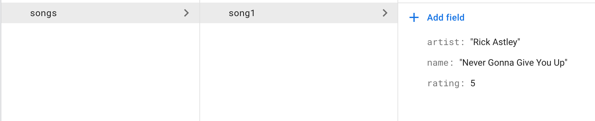

# A2

For the second assignment, you will be working with Firebase to perform CRUD
operations and use queries on a database. In this assignment, we're going to 
create a database of songs. 

## Part 1: Creating the database 

First, navigate to [Firebase](https://firebase.google.com/) and create a 
new project. Go to the settings icon in the upper left, and click on it. Then,
click project settings and go to service accounts. Copy and paste the code 
snippet provided into your `index.js` file. Generate a new private key
and and rename it to `service-account.json`. Put this file in the root of your 
project. Go to the database section (in the navigation bar on the left) and 
create a new realtime database. 

## Part 2: Manually make a collection

After the realtime database is created, make a new collection in the database
called "Songs". Within this collection, create a document called "song1". 
This document will have three fields, "name", "artist", and "rating", with 
respective values "Never Gonna Give You Up", "Rick Astley", and your 
personal rating of the song out of 5. At this point, your database should look 
something like this: 



## Part 3: Create new songs

Write a `POST` request with route `/createSong`. This request will simply create
a new song document in the songs collection of the database. The name of the 
document should be AUTOMATICALLY generated, not a name of your choice.

We will be passing information in the request body (`req.body`) in the following format: 

```
{
  name: string, 
  artist: string, 
  rating: int
}
```

## Part 4: Read the list of songs

Write a `GET` request with route `/getSongs`. This will return a list of the 
songs in the songs collection, sorted alphabetically by their name. 

## Part 5: Update a song's rating

Write a `POST` request with route `/updateRating`. This request will update a 
specific song's rating in the songs collection of the database. The song will 
be identified by its ID in the collection. 

We will be passing information in the request body (`req.body`) in the 
following format: 

```
{
  id: string,
  rating: int
} 
```

## Part 6: Delete a song

Write a `DELETE` request with route `/deleteSong`. This request will delete
a specific song from the songs collection of the database. The song will be 
identified by its ID in the collection. 

We will be passing the ID of the song in the query parameters (`req.query`) 
as a parameter called `id`. 

For example, a request to `/deleteSong?id=song1` would delete the song 
you created in the first part of the assignment (But if you do try deleting
that specific one, make sure you add it back, because we will be testing
that it is there).

## Part 7: Submission

Submit your assignment as a zip containing your `service-account.json` and 
`index.js` files. While it is generally bad practice to expose your keys, 
it is necessary for us to be able to test the functionality of the assignment. 
Don't worry, we won't fill your database with junk! 😊😊😊
